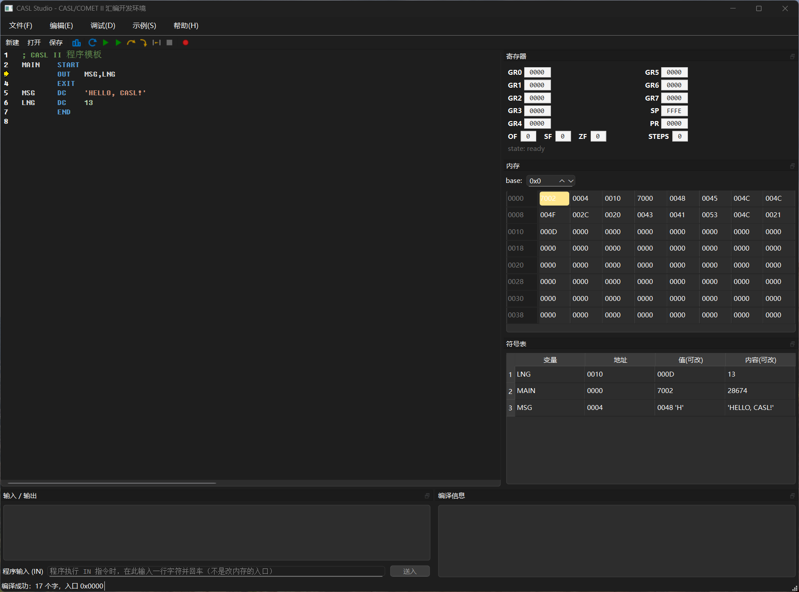
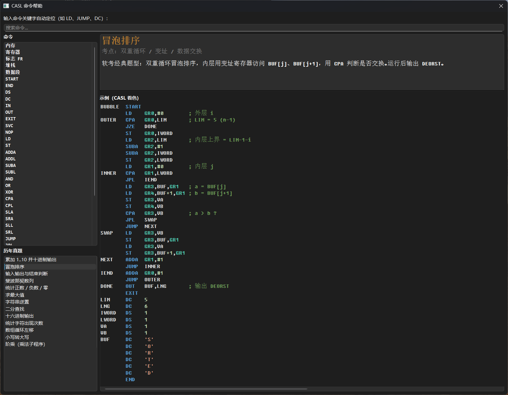

# CASL Studio

**桌面版 CASL / COMET II 汇编开发环境** —— 面向老软考（高级程序员）CASL 题目练习、教学与怀旧的 Windows 应用。

编辑、编译、运行、单步调试、断点、寄存器 / 内存 / 变量观察、输入输出模拟，一应俱全；
快捷键与操作习惯与 Visual Studio / VC6 一致，零基础也能上手（内置面向初学者的图文帮助）。

## 界面

| 主界面（编辑 + 调试 + 面板） | 帮助系统（F1） |
| :---: | :---: |
|  |  |

## 下载

到 [Releases](../../releases) 页下载最新免安装包（如 `CASL-Studio-v1.0.0-win64.zip`），解压后直接运行 `CASLStudio.exe`，无需安装。包内含 Qt 运行库与 `vc_redist.x64.exe`（若启动报缺 DLL，先运行它安装 VC 运行时）。

## 功能一览

### 编辑器
- QScintilla 2.14.1 语法高亮（关键字 / 注释 / 字符串 / 数字 / 寄存器着色），行号、当前行高亮、括号匹配
- 深浅色主题自动跟随系统（Fixedsys Excelsior 3.01 / 12pt，经典怀旧字体）
- **Ctrl+F** VS Code 风格查找条：`Aa` 大小写 / `ab` 全字匹配、`第 N 项,共 M 项` 计数、上下导航（Enter / Shift+Enter / Esc）
- 悬停提示：鼠标放在 `GR0`、`SP`、标号上直接显示当前值

### 调试（Visual Studio 风格）
| 快捷键 | 功能 |
| --- | --- |
| **F7** | 编译（检查语法错误，编译通过后调试按钮才可用） |
| **F5** | 开始调试 / 继续（遇断点暂停） |
| **Ctrl+F5** | 开始执行（不调试，忽略断点） |
| **F10** | 逐过程 |
| **F11** | 逐语句 |
| **Shift+F11** | 跳出（运行至当前子程序返回） |
| **Shift+F5** | 停止调试 |
| **Ctrl+Shift+F5** | 重新调试（复位后从头运行到第一个断点） |
| **F9** | 切换断点（点击编辑器左侧行号区亦可） |

### 观察与修改（VC6 风格）
- **寄存器面板**：GR0–GR7 / SP / PR / OF·SF·ZF / 执行步数实时刷新
- **变量面板（Watch）**：所有标号的地址 + 当前值 + **内容**列——`DC 'HELLO'` 定义的字符串常数整串显示；两列均可双击**运行时改写内存**：单字支持 `0041` / `#41` / `65` / `-1` / `'A'`，整串直接输入新文本（如 `NI HAO`）逐字符替换
- **内存面板**：8×8 十六进制窗口，高亮 PR 指向的指令字，双击任意单元可直接改写
- **输入 / 输出面板**：`OUT` 输出显示于此；程序执行 `IN` 时解锁输入框等待输入——只输入字符本身（如 `Hello`），机器自动数出长度写入 len
- **编译信息面板**：语法错误列表，点击跳到对应源程序行

### 帮助系统（F1）
- 34 条 CASL 指令的语法、用途与**带具体数字的算例**（如 `ST GR2,BUF,GR1`：GR1=5 → 写入 BUF+5 这个字，附字/字节区别说明）
- 面向零基础的概念条目：内存（储物柜类比）、寄存器（小本本）、标志 FR（三盏灯）、堆栈（盘子摞）、数据段
- 13 道历年真题经典题型（累加、冒泡、回显、斐波那契、正负零统计、最大值、字符串逆置、二分查找、十六进制输出、字符计数、循环左移、大小写转换、阶乘子程序）附完整可运行源码
- 搜索框 + 命令列表 + 用法说明与着色示例代码上下分栏（可拖动分隔条）

## CASL 语法速记

- `#` 前缀是**十六进制**：`LD GR0,#10` 装入的是 16，不是 10
- **GR0 不能作变址寄存器**（指令中变址位置写 GR0 等于没有变址）—— CASL 头号陷阱
- 有效地址 EA = addr + GRx 的**内容**，偏移以**字**为单位（不是字节）
- 移位指令的移位数取自内存中一个字的值（`SLA GR0,#3` 的 `#3` 会进字面量池）
- `IN BUF,LNG` / `OUT BUF,LNG`：第二个操作数是存放长度的标号；IN 输入时长度由机器自动统计；缓冲区建议 `DS 256`
- 栈向下生长，初始 `SP = 0xFFFE`；`CALL` 压入返回地址，`RET` 弹出
- 程序以 `EXIT` 结束（汇编为 SVC 0）

## 从源码构建

### 依赖
- CMake ≥ 3.21 + Visual Studio 2022（MSVC v143）
- Qt 6（本仓库按 `C:\Qt\6.8.3\msvc2022_64` 配置，可自行修改前缀路径）
- QScintilla（可选）：已内置针对 Qt 6.8.3 预编译的 `third_party/qscintilla`；缺失时自动降级为内置 QPlainTextEdit 编辑器（功能完整，高亮简化）

### 一键构建

```bat
build-app.cmd
```

产物：`build\app\Release\CASLStudio.exe`（所需 Qt / QScintilla DLL 自动拷贝到旁边，samples 示例目录一并部署）。

### 手动构建

```bat
cmake -S . -B build -DCMAKE_PREFIX_PATH=C:\Qt\6.8.3\msvc2022_64
cmake --build build --config Release
```

### 仅构建 / 测试核心库（无 Qt 依赖）

```bat
cmake -S . -B build-core -DCASL_BUILD_UI=OFF
cmake --build build-core --config Debug
build-core\core\tests\Debug\test_assembler.exe
build-core\core\tests\Debug\test_machine.exe
```

### 测试

三层测试全部通过后发布：核心库 24 项（汇编器 + 机器）、运行器 12 项（信号投递、断点、单步）、GUI 49 项（离屏驱动真实主窗口：面板刷新、查找条、按钮门控、Watch 字符串显示与编辑、内存改写）。

## 示例程序（samples/，16 个）

| 文件 | 内容 |
| --- | --- |
| `hello.casl` | OUT 输出字符串 |
| `arith.casl` | 字面量算术（`#10` 是十六进制 16） |
| `sum.casl` | 变址寄存器循环求和 |
| `sum10.casl` | 1..10 求和并十进制输出（除 10 取余 + 倒序） |
| `bubble.casl` | 冒泡排序，排序后输出 |
| `echo.casl` | IN/OUT 回显 |
| `fib.casl` | 斐波那契数列 |
| `sign.casl` | 正 / 负 / 零统计 |
| `max.casl` | 求数组最大值 |
| `reverse.casl` | 字符串逆置（双下标交换，GR0 陷阱示例） |
| `bsearch.casl` | 二分查找（SRL 除 2 + 三路分支） |
| `hexout.casl` | 十六进制输出（移位 + AND 取位） |
| `countch.casl` | 统计字符出现次数 |
| `rotate.casl` | 数组循环左移 |
| `upper.casl` | 小写转大写 |
| `fact.casl` | 阶乘乘法子程序（CALL/RET） |

## 架构：核心逻辑与 UI 分离

```
┌───────────────────────────────────────────────┐
│ app/                  Qt Widgets 前端          │
│   CodeEditor   编辑器（QScintilla / 降级双实现） │
│   MachineRunner 调试执行引擎（后台线程、快照）    │
│   MainWindow   主窗口（工具栏、面板、调试动作）    │
│   Panels       寄存器/内存/变量/控制台/编译信息    │
│   FindBar      VS Code 风格查找条               │
│   CommandHelp  帮助系统（指令/概念/真题）         │
└───────────────┬───────────────────────────────┘
                │ 仅依赖纯 C++ 头文件
┌───────────────┴───────────────────────────────┐
│ core/                 casl-core 静态库（无 Qt）  │
│   Assembler    CASL II 两遍汇编器              │
│   Machine      COMET II 虚拟机（GR0-7/SP/PR/FR)│
│   OpCode       指令集定义                       │
│   tests/       24 项单元测试（纯标准库）          │
└───────────────────────────────────────────────┘
```

- **core 库零 Qt 依赖**，可单独编译、单独测试，未来可接任何前端（CLI、Web……）
- 机器跑在专用 `std::thread` 上，UI 通过互斥锁保护的**快照**通信，永不卡死
- 代码风格：C++17 / MFC 式匈牙利命名法（类 `C` 前缀、成员 `m_` 前缀、函数 PascalCase）

## 已知限制

- 移位指令的移位数取自内存字的值（COMET II 语义），有效范围 0..15
- `IN` 输入行最长 256 字符（与 COMET II 常见实现一致），缓冲区过小会越界覆盖后续内存（COMET II 不做边界检查——这本身就是软考考点）
- 未实现 CASL II（2007 修订）的扩展指令，按老软考指令集为准

## License

[MIT](LICENSE) © Lusp

## 致谢

- [QScintilla](https://www.riverbankcomputing.com/software/qscintilla/)（Qt 编辑器组件）
- [Fixedsys Excelsior](https://github.com/kika/fixedsys)（情怀字体）
- 当年出 CASL 题的软考命题组，和所有在机房里熬过的老程序员们
